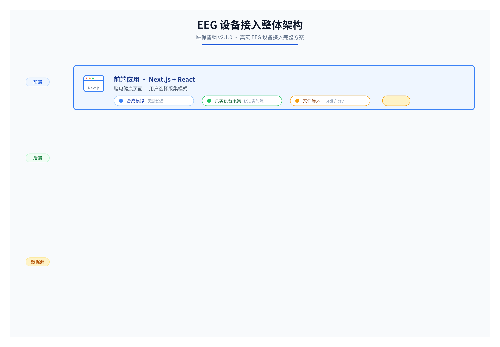

# EEG 设备接入指南

> MedSignal v2.2.0 — 真实 EEG 设备接入完整方案
> 支持 Muse / Emotiv / OpenBCI / 通用 CSV/EDF 文件导入

---

## 目录

- [整体架构](#整体架构)
- [方式一：Muse 头环实时采集（推荐）](#方式一muse-头环实时采集推荐)
- [方式二：Emotiv 设备接入](#方式二emotiv-设备接入)
- [方式三：OpenBCI 设备接入](#方式三openbci-设备接入)
- [方式四：离线文件导入（最简单）](#方式四离线文件导入最简单)
- [API 接口说明](#api-接口说明)
- [信号质量检查](#信号质量检查)
- [常见问题排查](#常见问题排查)

---

## 整体架构

> **专业架构图**：以下为文本版架构示意，高清可视化版本见：
> - **本地 PNG**：[`../diagrams/2026-06-23T215533/diagram.png`](../diagrams/2026-06-23T215533/diagram.png)
> - **本地 SVG**：[`../diagrams/2026-06-23T215533/diagram.svg`](../diagrams/2026-06-23T215533/diagram.svg)
> - **飞书在线画板**（可编辑）：https://my.feishu.cn/docx/VomJdKGM8o8RbcxIps6cnCdYnOd



**文本版架构示意**：

```
┌─────────────────────────────────────────────────────────────┐
│                        前端（Next.js）                       │
│   脑电健康页面 → 选择模式：[合成模拟] [真实设备] [文件导入]   │
└──────────┬──────────────────────────────────┬───────────────┘
           │ POST /api/eeg/{uid}/session       │ POST /api/eeg/{uid}/import
           │ (合成或真实设备流)                 │ (上传 .edf/.csv)
           ▼                                   ▼
┌─────────────────────────────────────────────────────────────┐
│                    后端（FastAPI）                           │
│                                                              │
│  ┌─────────────┐  ┌──────────────────┐  ┌────────────────┐ │
│  │ eeg.py      │  │ device_adapter.py│  │ engine.py      │ │
│  │ (Router)    │──│ (设备适配层)     │──│ (分析引擎)     │ │
│  │             │  │ - Muse LSL       │  │ - 频域分析     │ │
│  │ 接收信号    │  │ - Emotiv CSV     │  │ - 健康指标     │ │
│  │ 调用引擎    │  │ - OpenBCI LSL    │  │ - 异常预警     │ │
│  │             │  │ - CSV/EDF 解析   │  │ - 政策联动     │ │
│  └─────────────┘  └──────────────────┘  └────────────────┘ │
└─────────────────────────────────────────────────────────────┘
           ▲                                   ▲
           │ LSL Stream / BLE                  │ 文件上传
           │                                   │
┌──────────┴──────────┐              ┌────────┴────────┐
│   EEG 设备（实时）   │              │  EEG 文件（离线）│
│   Muse / Emotiv 等  │              │  .edf / .csv    │
└─────────────────────┘              └─────────────────┘
```

**核心设计**：设备适配层（`device_adapter.py`）将不同设备的信号统一为 `(signals, channels, sample_rate)` 格式，直接喂给已有的分析引擎。**引擎的频域分析、指标计算、政策联动逻辑完全复用，无需修改。**

---

## 方式一：Muse 头环实时采集（推荐）

本项目原生支持 Muse 4 通道布局（TP9/AF7/AF8/TP10，256Hz），接入最简单。

### 1.1 硬件准备

| 设备 | 说明 |
|---|---|
| Muse 2 / Muse S | 4 通道 EEG 头环 |
| 蓝牙 4.0+ 适配器 | Windows 自带或 USB 蓝牙 dongle |

### 1.2 安装 LSL 驱动（Lab Streaming Layer）

LSL 是 EEG 设备实时流传输的标准协议，Muse 通过 [Muse LSL](https://github.com/alexandrebarachant/muse-lsl) 推送数据。

```bash
# 1. 安装 Muse LSL 工具（Python 环境）
pip install muselsl
pip install pylsl bleak

# 2. 安装 Muse Lab（可选，可视化工具）
# 下载：https://github.com/alexandrebarachant/muse-lsl/releases
```

### 1.3 连接设备并推送 LSL 流

**步骤 1：搜索并连接 Muse 设备**

```bash
# 搜索附近的 Muse 设备
muselsl list

# 输出示例：
# Found device Muse-XXXX, MAC Address: XX:XX:XX:XX:XX:XX
```

**步骤 2：启动 LSL 流（开始推送 EEG 数据到 LSL）**

```bash
# 连接设备并开始推送 LSL 流（保持终端运行）
muselsl stream

# 输出示例：
# Looking for a Muse...
# Connected to Muse-XXXX
# Streaming data to LSL...
```

**步骤 3：验证 LSL 流可用**

```bash
# 查看可用的 LSL 流
muselsl view

# 输出示例：
# Found 1 stream: "Muse-XXXX" (4 channels, 256 Hz)
```

### 1.4 后端配置

```bash
# 在 backend/.env 中添加
EEG_DEVICE_TYPE=muse_lsl
EEG_LSL_STREAM_NAME=auto    # auto 表示自动搜索第一个 EEG 流
EEG_LSL_STREAM_TYPE=EEG
EEG_ACQUIRE_SECONDS=4       # 单次采集时长
```

### 1.5 启动采集

后端启动后，调用真实设备采集端点：

```bash
# 发起一次真实设备 EEG 采集（4 秒）
curl -X POST "http://localhost:8000/api/eeg/1/session-device?duration_seconds=4"
```

或在前端脑电页面选择"真实设备采集"模式，点击"开始采集"。

### 1.6 Python 脚本采集（可选，用于调试）

```python
# scripts/test_muse_lsl.py
"""测试 Muse LSL 连接"""
from pylsl import StreamInlet, resolve_byprop
import time

# 搜索 EEG 流
print("搜索 LSL EEG 流...")
streams = resolve_byprop('type', 'EEG', timeout=10)
if not streams:
    print("❌ 未找到 EEG 流，请先运行 muselsl stream")
    exit(1)

inlet = StreamInlet(streams[0])
print(f"✅ 连接到流: {streams[0].name()}")
print(f"   通道数: {streams[0].channel_count()}")
print(f"   采样率: {streams[0].nominal_srate()} Hz")

# 采集 4 秒数据
print("采集 4 秒数据...")
samples = []
start = time.time()
while time.time() - start < 4:
    sample, timestamp = inlet.pull_sample(timeout=1.0)
    if sample:
        samples.append(sample)

print(f"✅ 采集完成，共 {len(samples)} 个采样点")
print(f"   第一个样本: {samples[0]}")
```

---

## 方式二：Emotiv 设备接入

### 2.1 安装 Emotiv PRO

1. 下载 [Emotiv PRO](https://www.emotiv.com/developer/) （开发者版需订阅）
2. 连接设备，确认数据流正常

### 2.2 通过 Emotiv Cortex API 推送 LSL

```bash
# 安装 Emotiv Cortex 客户端
pip install cortex

# 使用 Emotiv Cortex 的 LSL 桥接
# 在 Emotiv PRO 设置中启用 "LSL Stream" 输出
```

### 2.3 配置

```bash
# backend/.env
EEG_DEVICE_TYPE=emotiv_lsl
EEG_LSL_STREAM_NAME=EmotivXXXX   # Emotiv PRO 中显示的流名
EEG_LSL_STREAM_TYPE=EEG
```

> Emotiv EPOC 是 14 通道，引擎会自动取前 4 通道或按通道名映射。

---

## 方式三：OpenBCI 设备接入

### 3.1 安装 OpenBCI GUI + LSL

1. 下载 [OpenBCI GUI](https://github.com/OpenBCI/OpenBCI_GUI/releases)
2. 连接 Cyton/Daisy 板，确认数据流正常
3. 在 OpenBCI GUI 中：Networking → Protocol = LSL → Stream 1 = TimeSeries → Start LSL Stream

### 3.2 配置

```bash
# backend/.env
EEG_DEVICE_TYPE=openbci_lsl
EEG_LSL_STREAM_NAME=openbci_eeg1   # OpenBCI GUI 中配置的流名
EEG_LSL_STREAM_TYPE=EEG
```

### 3.3 通道映射

OpenBCI Cyton 默认 8 通道（通道名可能不是 TP9/AF7/AF8/TP10）。系统会自动按顺序取前 4 通道，并在结果中标注实际通道名。

---

## 方式四：离线文件导入（最简单）

无需连接设备，用设备官方软件录制 EEG 文件后上传。

### 4.1 支持的文件格式

| 格式 | 来源 | 说明 |
|---|---|---|
| `.csv` | 通用 | 第一行为通道名，后续每行一个采样点 |
| `.edf` | 临床标准 | European Data Format，医院 EEG 常用 |
| `.txt` | Muse / OpenBCI 导出 | 制表符/逗号分隔 |

### 4.2 CSV 文件格式要求

```csv
TP9,AF7,AF8,TP10
-12.5,8.3,-5.1,10.2
-11.8,7.9,-4.8,9.8
-13.2,8.5,-5.5,10.5
...
```

- 第一行：通道名（建议 TP9/AF7/AF8/TP10，其他名称也可，按顺序映射）
- 第二行起：每行一个采样点的各通道电压值（微伏 μV）
- 采样率：在文件名或上传参数中指定（默认 256Hz）

### 4.3 录制 EEG 文件

**用 Muse Lab 录制：**
1. 打开 Muse Lab，连接 Muse
2. File → Record → 选择 CSV 格式
3. 录制 4-30 秒
4. 保存文件

**用 OpenBCI GUI 录制：**
1. 打开 OpenBCI GUI，开始数据流
2. 点击 "Record" → 选择 OpenBCI 格式（可转 CSV）
3. 录制后导出 CSV

### 4.4 上传分析

```bash
# 上传 CSV 文件分析
curl -X POST "http://localhost:8000/api/eeg/1/import" \
  -F "file=@eeg_recording.csv" \
  -F "sample_rate=256" \
  -F "mental_state=relaxed"
```

或在前端脑电页面选择"文件导入"模式，拖拽文件上传。

---

## API 接口说明

### 1. 真实设备采集

```
POST /api/eeg/{user_id}/session-device?duration_seconds=4
```

从已连接的 EEG 设备（通过 LSL）实时采集信号并分析。

**响应**：与合成采集相同的 `EEGSession` 结构，额外包含 `source: "device"` 和 `device_info`。

### 2. 文件导入分析

```
POST /api/eeg/{user_id}/import
```

**参数**：
- `file`：EEG 文件（.csv / .edf / .txt）
- `sample_rate`：采样率（默认 256）
- `mental_state`：心理状态标签（用于结果标注，默认 "auto"）

**响应**：`EEGSession` 结构，额外包含 `source: "file"` 和 `file_info`。

### 3. 信号质量检查

```
GET /api/eeg/device/check
```

检查 LSL 设备连接状态和信号质量。

**响应**：
```json
{
  "connected": true,
  "device_name": "Muse-XXXX",
  "channels": ["TP9", "AF7", "AF8", "TP10"],
  "sample_rate": 256,
  "signal_quality": "good",
  "impedance": {"TP9": "good", "AF7": "fair", ...}
}
```

---

## 信号质量检查

### 采集前检查清单

1. **电极接触**：所有电极应湿润且贴合头皮
2. **阻抗检查**：阻抗应 < 50kΩ（Muse LED 显示蓝色为良好）
3. **环境干扰**：远离手机、路由器等电磁干扰源
4. **被试状态**：闭眼放松，避免眨眼和吞咽

### 信号质量评估

系统自动评估信号质量，分为三级：

| 等级 | 判定条件 | 建议 |
|---|---|---|
| good | 50Hz 工频 < 10%，信号幅度 10-100μV | 可用于分析 |
| fair | 50Hz 工频 10-30%，或幅度异常 | 建议重新调整电极 |
| poor | 50Hz 工频 > 30%，或幅度 > 200μV | 不可用，需重新采集 |

---

## 常见问题排查

### Q1: muselsl 找不到设备

```bash
# 1. 确认蓝牙已开启
# 2. 确认 Muse 已开机（长按按钮，LED 亮起）
# 3. 确认 Muse 未连接其他设备（手机 APP 需断开）
# 4. 重新搜索
muselsl list
```

### Q2: LSL 流连接超时

```bash
# 1. 确认 muselsl stream 正在运行
# 2. 检查防火墙是否阻止 LSL（UDP 端口 16571）
# 3. 尝试指定流名连接
# 在 .env 中设置 EEG_LSL_STREAM_NAME=Muse-XXXX
```

### Q3: 信号全是噪声

1. 检查电极是否湿润（用导电膏或生理盐水）
2. 检查电极位置是否正确（TP9 左耳后，TP10 右耳后，AF7 左额，AF8 右额）
3. 确认被试保持静止，避免运动伪迹
4. 远离电源线和电器

### Q4: CSV 文件导入失败

```bash
# 检查文件格式
# 1. 第一行必须是通道名（逗号分隔）
# 2. 数据行不能有空值
# 3. 采样率必须与实际录制一致

# 用 Python 验证
python -c "
import csv
with open('eeg.csv') as f:
    reader = csv.reader(f)
    header = next(reader)
    print('通道:', header)
    row = next(reader)
    print('第一行数据:', row)
    print('数据列数:', len(row))
"
```

### Q5: Windows 蓝牙连接不稳定

```bash
# 1. 更新蓝牙驱动
# 2. 使用 USB 蓝牙 4.0 dongle（比内置蓝牙稳定）
# 3. 关闭蓝牙省电模式：
#    设备管理器 → 蓝牙 → 属性 → 电源管理 → 取消"允许计算机关闭此设备"
```

### Q6: 多设备同时连接

```bash
# 在 .env 中指定具体的流名
EEG_LSL_STREAM_NAME=Muse-ABCD   # 精确匹配设备名
```

---

## 设备对比

| 特性 | Muse 2/S | Emotiv EPOC X | OpenBCI Cyton |
|---|---|---|---|
| 通道数 | 4 (TP9/AF7/AF8/TP10) | 14 | 8 (可扩展 16) |
| 采样率 | 256 Hz | 256 Hz | 250 Hz |
| 连接方式 | 蓝牙 | 蓝牙/2.4G | 蓝牙/USB/RF |
| 价格 | ~$200 | ~$800 | ~$500 |
| 电极类型 | 干电极 | 湿电极 | 可选干/湿 |
| LSL 支持 | ✅ muselsl | ✅ Cortex API | ✅ GUI 内置 |
| 本项目适配 | ✅ 原生 | ✅ 自动映射 | ✅ 自动映射 |
| 路演推荐 | ⭐ 最适合 | 适合 | 适合 |

---

## 路演现场快速接入（5 分钟）

```bash
# 1. 安装驱动（一次性）
pip install muselsl pylsl bleak

# 2. 连接 Muse 并推送 LSL 流（终端 1）
muselsl stream

# 3. 启动后端（终端 2）
cd backend && uvicorn app.main:app --reload

# 4. 启动前端（终端 3）
cd frontend && npm run dev

# 5. 打开 http://localhost:3000/eeg
#    选择"真实设备采集" → 点击"开始采集" → 戴上 Muse → 完成
```
